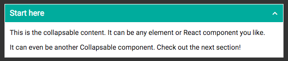

# React Responsive Collapsible Section Component (Collapsible)

React component to wrap content in Collapsible element with trigger to open and close.


It's like an accordion, but where any number of sections can be open at the same time.

## Installation
Installation can be achieved via NPM.
```
npm install react-collapsible
```

## Usage
Collapsible can receive any HTML elements or React component as it's children. Collapsible will wrap the contents, as well as generate a trigger element which will control showing and hiding.

### ES6
```javascript

import React from 'react';
import Collapsible from 'react-collapsible';

var App = React.createClass({

  render: function() {
    return(

      <Collapsible triggerText="Start here">
        <p>This is the collapsible content. It can be any element or React component you like.</p>
        <p>It can even be another Collapsible component. Check out the next section!</p>
      </Collapsible>

    );
  }

});

export default App;


```

With a little CSS becomes


