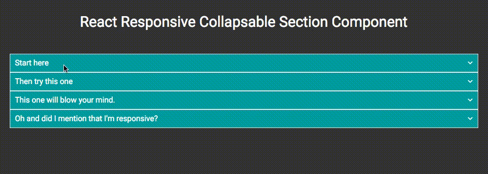

# React Responsive Collapsable Section Component (Collapsable)

React component to wrap content in Collapsable element with trigger to open and close.



It's like an accordion, but where any number of sections can be open at the same time.

## Installation
Installation can be achieved via NPM.
```
npm install react-collapsble
```

## Usage
Collapsable can receive any HTML elements or React component as it's children. Collapsable will wrap the contents, as well as generate a trigger element which will control showing and hiding.

### JSX
```xml
<Collapsable triggerText="Start here">
  <p>This is the collapsable content. It can be any element or React component you like.</p>
  <p>It can even be another Collapsable component. Check out the next section!</p>
</Collapsable>
```

With a little CSS becomes


